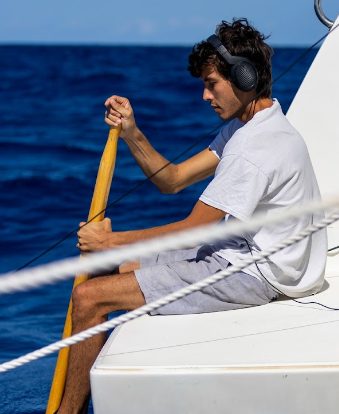

---
hide:
  - navigation
  - toc
---

<aside class="author-card">
  
  <h2>Paul Best</h2>
  
Researcher in animal communication and computational bioacoustics

  <ul>
    <li><a href="mailto:paul.best@univ-amu.fr">Email</a></li>
    <li><a href="https://orcid.org/0000-0003-4996-0726">ORCID</a></li>
    <li><a href="https://scholar.google.com/citations?user=2NFE_I4AAAAJ">Google Scholar</a></li>
  </ul>
</aside>

# Publications

## Multi-interaction: a new open-access approach for studying multimodal communication and interactions across species

Habib-Dassetto, L., Best, P., Cauzinille, J., Marques, A., Adet, M., Portes, C., et al. · Animal Behaviour · 2026

<em>A tool for analysing multimodal interactions and comparing their structure across species and behavioural contexts.</em>

Habib-Dassetto, L., Best, P., Cauzinille, J., Marques, A., Adet, M., Portes, C., ... & Montant, M. 2026. "Multi-interaction: a new open-access approach for studying multimodal communication and interactions across species." *Animal Behaviour*, 123526.  
[DOI](https://doi.org/10.1016/j.anbehav.2026.123526){ .publication-link }

## Spatial validation of acoustic individual identification models without ground truths: a case study with the cao-vit gibbon population

Best, P., Dassow, A., Kershenbaum, A., Nguyen, T. D., Pogson, M., Maheshwari, A., and Marxer, R. · PeerJ · 2026

<em>A spatial approach to validating acoustic individual-identification models when labelled ground-truth identities are unavailable.</em>

Best, P., Dassow, A., Kershenbaum, A., Nguyen, T. D., Pogson, M., Maheshwari, A., and Marxer, R. 2026. "Spatial validation of acoustic individual identification models without ground truths: a case study with the cao-vit gibbon population." *PeerJ* 14: e20655.  
[DOI](https://doi.org/10.7717/peerj.20655){ .publication-link }

## Opportunistic Observation of Long-Finned Pilot Whales Interacting with a Solitary Humpback Whale in the Gascogne Gulf (Northwest Atlantic)

Best, P., Habib-Dassetto, L., Cauzinille, J., Legou, T., Delfour, F., and Montant, M. · Aquatic Mammals · 2025

<em>An opportunistic field observation documenting interactions between long-finned pilot whales and a solitary humpback whale.</em>

Best, P., Habib-Dassetto, L., Cauzinille, J., Legou, T., Delfour, F., and Montant, M. 2025. "Opportunistic Observation of Long-Finned Pilot Whales Interacting with a Solitary Humpback Whale in the Gascogne Gulf (Northwest Atlantic)." *Aquatic Mammals* 51(6).  
[DOI](https://doi.org/10.1578/AM.51.6.2025.515){ .publication-link }

## Analysing vocal complexity in relation to sociality in orcas of British Columbia: An application of long-term computational passive acoustics

Best, P., Poupard, M., Marxer, R., Spong, P., Symonds, H., and Glotin, H. · Ecological Informatics · 2025

<em>A long-term passive-acoustic analysis testing how social and ecological factors affect the complexity of orca call sequences.</em>

Best, P., Poupard, M., Marxer, R., Spong, P., Symonds, H., and Glotin, H. 2025. "Analysing vocal complexity in relation to sociality in orcas of British Columbia: An application of long-term computational passive acoustics." *Ecological Informatics*, 103211.  
[DOI](https://doi.org/10.1016/j.ecoinf.2025.103211){ .publication-link }

## A large annotated dataset of vocalizations by common marmosets

Lamothe, C., Obliger-Debouche, M., Best, P., Trapeau, R., Ravel, S., Artières, T., et al. · Scientific Data · 2025

<em>A large annotated vocalisation dataset supporting research on the common marmoset repertoire, neuroscience, and voice perception.</em>

Lamothe, C., Obliger-Debouche, M., Best, P., Trapeau, R., Ravel, S., Artières, T., ... & Belin, P. 2025. "A large annotated dataset of vocalizations by common marmosets." *Scientific Data* 12(1): 782.  
[DOI](https://doi.org/10.1038/s41597-025-04951-8){ .publication-link }

## Bioacoustic fundamental frequency estimation: a cross-species dataset and deep learning baseline

Best, P., Araya-Salas, M., Ekström, A. G., Freitas, B., Jensen, F. H., et al. · Bioacoustics · 2025

<em>A cross-species benchmark and deep-learning baseline for estimating fundamental-frequency contours in animal vocalisations.</em>

Best, P., Araya-Salas, M., Ekström, A. G., Freitas, B., Jensen, F. H., ... & Marxer, R. 2025. "Bioacoustic fundamental frequency estimation: a cross-species dataset and deep learning baseline." *Bioacoustics*, 1-28.  
[DOI](https://doi.org/10.1080/09524622.2025.2500380){ .publication-link }

## Automatic detection for bioacoustic research: a practical guide from and for biologists and computer scientists

Kershenbaum, A., Akçay, Ç., Babu-Saheer, L., Barnhill, A., Best, P., Cauzinille, J., et al. · Biological Reviews · 2025

<em>A practical interdisciplinary guide to designing, evaluating, and applying automatic animal-vocalisation detectors.</em>

Kershenbaum, A., Akçay, Ç., Babu-Saheer, L., Barnhill, A., Best, P., Cauzinille, J., ... & Dunn, J. C. 2025. "Automatic detection for bioacoustic research: a practical guide from and for biologists and computer scientists." *Biological Reviews* 100(2): 620-646.  
[DOI](https://doi.org/10.1111/brv.13155){ .publication-link }

## A first vocal repertoire characterization of long-finned pilot whales (Globicephala melas) in the Mediterranean Sea: a machine learning approach

Poupard, M., Best, P., Morgan, J. P., Pavan, G., and Glotin, H. · Royal Society Open Science · 2024

<em>A machine-learning characterisation of the Mediterranean long-finned pilot whale vocal repertoire using deep audio representations.</em>

Poupard, M., Best, P., Morgan, J. P., Pavan, G., and Glotin, H. 2024. "A first vocal repertoire characterization of long-finned pilot whales (*Globicephala melas*) in the Mediterranean Sea: a machine learning approach." *Royal Society Open Science* 11(11): 231973.  
[DOI](https://doi.org/10.1098/rsos.231973){ .publication-link }

## Deep audio embeddings for vocalisation clustering

Best, P., Paris, S., Glotin, H., and Marxer, R. · PLOS ONE · 2023

<em>A cross-species evaluation of deep audio embeddings for automatically grouping animal vocalisations into meaningful categories.</em>

Best, P., Paris, S., Glotin, H., and Marxer, R. 2023. "Deep audio embeddings for vocalisation clustering." *PLOS ONE* 18(7).  
[DOI](https://doi.org/10.1371/journal.pone.0283396){ .publication-link }

## Automated detection and classification of cetacean acoustic signals

Best, P. · Université de Toulon · 2022

<em>Doctoral research on computational methods for automatically detecting and classifying cetacean acoustic signals.</em>

Best, P. 2022. "Automated detection and classification of cetacean acoustic signals." Doctoral dissertation, Université de Toulon.  
[THESIS](https://hal.science/tel-03826638v1){ .publication-link }

## Temporal evolution of the Mediterranean fin whale song

Best, P., Marxer, R., Paris, S., and Glotin, H. · Scientific Reports · 2022

<em>An analysis of long-term changes in the song patterns of Mediterranean fin whales.</em>

Best, P., Marxer, R., Paris, S., and Glotin, H. 2022. "Temporal evolution of the Mediterranean fin whale song." *Scientific Reports* 12(1).  
[DOI](https://doi.org/10.1038/s41598-022-15379-0){ .publication-link }

## Passive acoustic monitoring of sperm whales and anthropogenic noise using stereophonic recordings in the Mediterranean Sea, North West Pelagos Sanctuary

Poupard, M., Ferrari, M., Best, P., and Glotin, H. · Scientific Reports · 2022

<em>Stereophonic passive-acoustic monitoring of sperm whale activity and anthropogenic noise in the Pelagos Sanctuary.</em>

Poupard, M., Ferrari, M., Best, P., and Glotin, H. 2022. "Passive acoustic monitoring of sperm whales and anthropogenic noise using stereophonic recordings in the Mediterranean Sea, North West Pelagos Sanctuary." *Scientific Reports* 12(1): 2007.  
[DOI](https://doi.org/10.1038/s41598-022-05917-1){ .publication-link }

## A 30 μW Embedded Real-Time Cetacean Smart Detector

Marzetti, S., Gies, V., Best, P., Barchasz, V., Paris, S., Barthélémy, H., and Glotin, H. · Electronics · 2021

<em>An ultra-low-power embedded system for real-time detection of cetacean vocalisations.</em>

Marzetti, S., Gies, V., Best, P., Barchasz, V., Paris, S., Barthélémy, H., and Glotin, H. 2021. "A 30 μW Embedded Real-Time Cetacean Smart Detector." *Electronics* 10(7): 819.  
[DOI](https://doi.org/10.3390/electronics10070819){ .publication-link }

## Deep Learning and Domain Transfer for Orca Vocalization Detection

Best, P., Ferrari, M., Poupard, M., Paris, S., Marxer, R., Symonds, H., et al. · International Joint Conference on Neural Networks · 2020

<em>A deep-learning and domain-transfer approach for detecting orca vocalisations across recording conditions.</em>

Best, P., Ferrari, M., Poupard, M., Paris, S., Marxer, R., Symonds, H., ... & Glotin, H. 2020. "Deep Learning and Domain Transfer for Orca Vocalization Detection." *International Joint Conference on Neural Networks*, 1-7.  
[DOI](https://doi.org/10.1109/IJCNN48605.2020.9207567){ .publication-link }

## Stereo to five-channels bombyx sonobuoys: from four years cetacean monitoring to real-time whale-ship anti-collision system

Best, P., Marzetti, S., Poupard, M., Ferrari, M., Paris, S., Marxer, R., et al. · Forum Acusticum · 2020

<em>The development of multichannel sonobuoys from long-term cetacean monitoring toward a real-time whale–ship collision-avoidance system.</em>

Best, P., Marzetti, S., Poupard, M., Ferrari, M., Paris, S., Marxer, R., ... & Glotin, H. 2020. "Stereo to five-channels bombyx sonobuoys: from four years cetacean monitoring to real-time whale-ship anti-collision system." *e-Forum Acusticum 2020*, 3229-3231.  
[PAPER](https://doi.org/10.7287/peerj.preprints.27979v1){ .publication-link }

## Large-scale unsupervised clustering of orca vocalizations: a model for describing orca communication systems

Poupard, M., Best, P., Schlüter, J., Symonds, H., Spong, P., Lengagne, T., et al. · Vocal Interactivity in-and-between Humans, Animals and Robots · 2019

<em>A large-scale unsupervised approach to organising orca vocalisations and describing their communication system.</em>

Poupard, M., Best, P., Schlüter, J., Symonds, H., Spong, P., Lengagne, T., ... & Glotin, H. 2019. "Large-scale unsupervised clustering of orca vocalizations: a model for describing orca communication systems." *Vocal Interactivity in-and-between Humans, Animals and Robots*.  
[PAPER](https://doi.org/10.7287/peerj.preprints.27979v1){ .publication-link }

